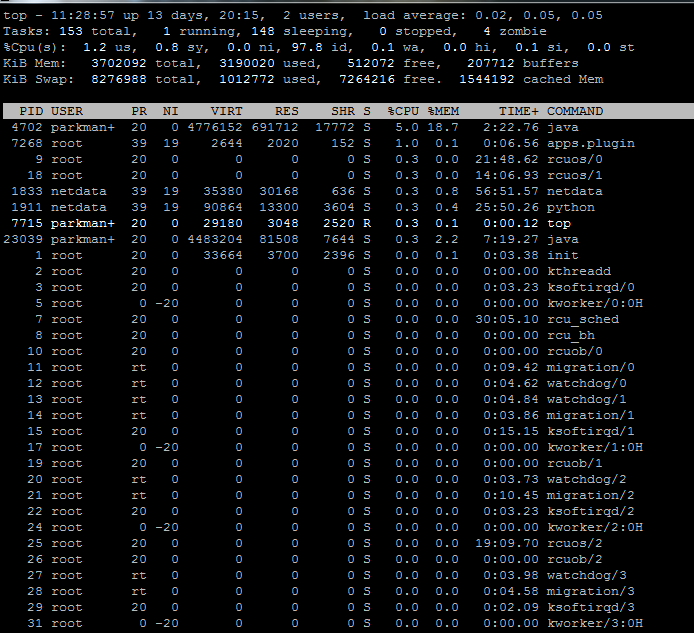
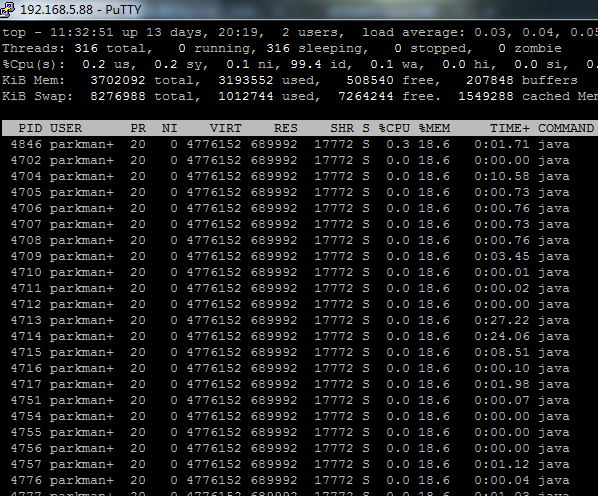
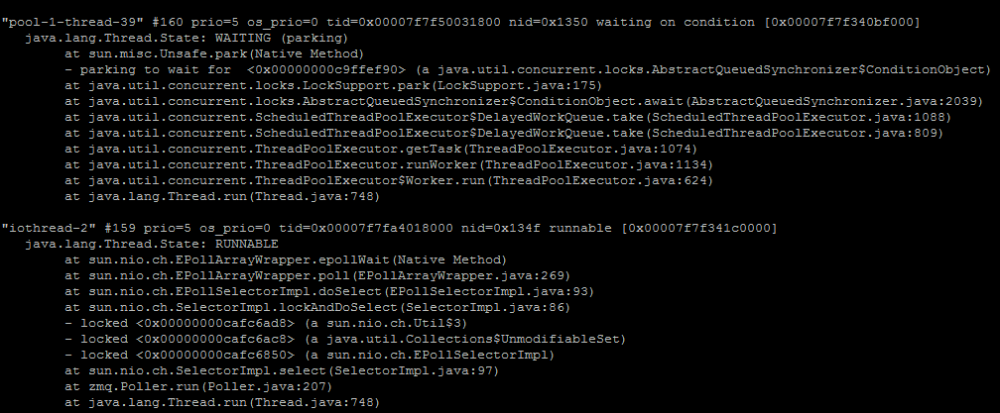
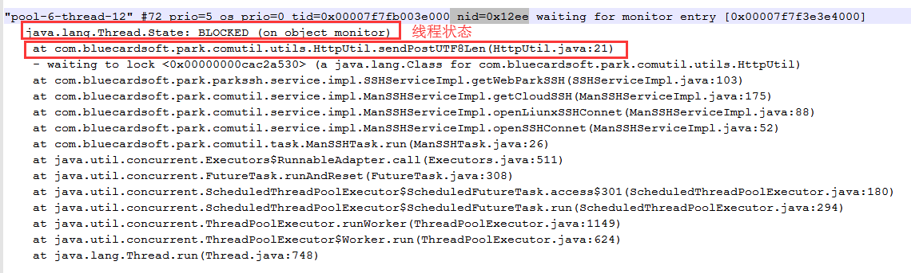

# grep

`用于查找文件里符合条件的字符串`

##命令

-a 或 --text 不忽略二进制的数据

-A <行数> 或 --after-context=<显示行数>  除了显示符合范本样式的那一列之外，并显示该行之后的内容。

-B<显示行数> 或 --before-context=<显示行数>  除了显示符合样式的那一行之外，并显示该行之前的内容

-c 或 --count 计算符合样式的列数

-e  或者 --regexp=<范本样式> 指定字符串为查找内容的样式

-H 或者 --with-filename 在显示符合样式的那一行前表示改行所属名称

-i 或者 --ignore-case 忽略字符大小写

-l 或者 --file-with-matches 列出文件内容符合指定的样式的文件名称

-n 或者 --line-number 在显示符合样式的那一行之前，标示出该行的列数编号

-r 或者--recursive  当指定要查找的是目录而非文件时，必须使用这项参数

-m 或者 --max-count=NUM  stop after NUM matches 与-A类似

-w 或 --word-regexp 只显示全字符合的列

## 测试

`过滤字符串为RT1019的信息，只显示当前行`

 grep -inr 'RT1019' -m 1 

查询字符串“RT1019”   i-忽略大小写、n-显示行数、r-遍历所有文件及文件夹  m符合范本样式的那一列之外，并显示该行之后的num行的内容

# netstat 

`命令用于显示网络状态`

## 命令

-a或--all 显示所有连线中的Socket

-c或--continuous 持续列出网络状态

-i或--interfaces 显示网络界面信息表单。

-l或--listening 显示监控中的服务器的Socket。

-n或--numeric 直接使用IP地址，而不通过域名服务器

-N或--netlink或--symbolic 显示网络硬件外围设备的符号连接名称

-o或--timers 显示计时器。

-p或--programs 显示正在使用Socket的程序识别码和程序名称

-t或--tcp 显示TCP传输协议的连线状况

-u或--udp 显示UDP传输协议的连线状况

## 测试

`查看当前网络处于TIME_WAIT状态的总数`

netstat -anp | grep -i time| wc  -l

查看当前网络状态， a-全部  n-显示网络硬件外围设备的符号连接名称 p-显示正在使用Socket的程序识别码和程序名称，过滤查出的文本

# du

`显示指定的目录或文件所占用的磁盘空间`

## 命令

-a或-all 显示目录中个别文件的大小

-c或--total 除了显示个别目录或文件的大小外，同时也显示所有目录或文件的总和

-h或--human-readable 以K，M，G为单位，提高信息的可读性

-s或--summarize仅显示总计

--exclude=<目录或文件> 略过指定的目录或文件

--max-depth=<目录层数> 超过指定层数的目录后，予以忽略

## 测试

du -h --max-depth=1 /var/lib/webpark/logs 

显示/var/lib/webpark/logs路径下 文件所占磁盘大小

# ps

`用于显示当前进程的状态`

## 命令

-A 列出所有的行程

-au 显示较详细的信息

-aux 显示所有包含其他使用者的行程

-aux 输出格式

USER   PID %CPU %MEM    VSZ(占用的虚拟记忆体大小)   RSS(占用的记忆体大小) TTY(终端的次要装置号码 (minor device number of tty))      STAT(该行程的状态) START(行程开始时间)   TIME(执行的时间) COMMAND(所执行的指令)

## 测试

ps -aux |grep java

显示java进程的状态

# split

`用于将一个文件分割成数个。将大文件分割成较小的文件，在默认情况下将按照每1000行切割成一个小文件`

## 命令

语法：

```shell
split [--help][--version][-<行数>][-b <字节>][-C <字节>][-l <行数>][要切割的文件][输出文件名]
```

-<行数>：指定每多少行切成一个小文件

-b <字节>：指定每多少字节切成一个小文件

-C <字节>：与参数"-b"相似，但是在切 割时将尽量维持每行的完整性

[输出文件名] : 设置切割后文件的前置文件名， split会自动在前置文件名后再加上编号

## 测试

split -1000 device  de

将device文件没1000行切割成一个文件

# ulimit

`用来控制shell执行程序的资源`

## 命令

-a 显示目前资源限制的设定

-n <文件数目> 　指定同一时间最多可开启的文件数

## 测试

`查看系统资源设置`

ulimit -a

# lsof

`list open files,列出当前系统打开文件的工具`

## 命令

`lsof输出各列信息`

COMMAND：进程的名称 

PID：进程标识符

USER：进程所有者

FD：文件描述符，应用程序通过文件描述符识别该文件。如cwd、txt等 TYPE：文件类型，如DIR、REG等

DEVICE：指定磁盘的名称

SIZE：文件的大小

NODE：索引节点（文件在磁盘上的标识）

NAME：打开文件的确切名称

-u uName: 显示所属user进程打开的文件

-c string: 显示 COMMAND 列中包含指定字符的进程所有打开的文件

-t: 仅获取进程ID

-p<进程号>: 列出指定进程号所打开的文件

`lsof -i[46] [protocol][@hostname|hostaddr][:service|port]`

46：IPv4 or IPv6

protocol：TCP or UDP

hostname：Internet host name

hostaddr：IPv4地址

service：/etc/service中的 service name (可以不只一个)

port：端口号 (可以不只一个)

## 测试实例

`查看谁正在使用某个文件`

 lsof  /var/lib/webpark/logs/webService/webService

`显示进程号(可以多个)打开文件总数`

lsof -p PID1,PID2 |wc -l

`仅显示端口8090对应的进程PID`

lsof -t -i:8080

# df

`用于显示目前在Linux系统上的文件系统的磁盘使用情况统计`

## 命令

文件-a, --all 包含所有的具有 0 Blocks 的文件系统

文件-h, --human-readable 使用人类可读的格式(预设值是不加这个选项的...)

文件-l, --local 限制列出的文件结构

## 测试

`查看指定目录所属挂载点,及挂载点的磁盘使用情况`

df -lh /var/lib/webpark

# linux java占用CPU过高分析

1.使用top命令查看各个进程的cpu使用情况，默认按cpu使用率排序



此时可以查到java进程的`PID = 4702`

2.通过 `top -Hp 4702` 可以查看该进程下各个线程的cpu使用情况



上图可以看到CPU较高的线程的`PID = 4846`

3.使用`jstack PID`命令查看该`进程`当前的堆栈状态

`jstack  4702` 注意此时的PID为`进程的PID`



使用`jstack 4702 > /var/lib/webpark/update/thread.log`将数据写入到文本中保存

jstack命令生成的thread dump信息包含了JVM中所有存活的线程

将CPU过高的`线程的PID`转成16进制的值，在thread dump中每个线程都有一个nid，找到对应的nid即可

例如:4846的16进制为12EE，在保存的文本中搜索`12EE`即可看到 nid=0x12ee的线程运行情况




