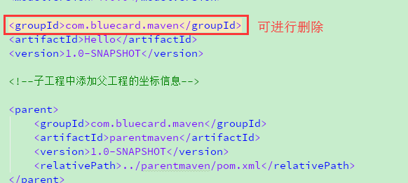

# maven

1、`服务于java平台`的自动化构建工具

2、构建

> 以java源文件、jsp、html、图片等资源为原材料去`生产`一个可以运行的项目的过程，即`生产的过程就是构建`

# 核心概念

1、约定的目录结构


2.POM

3.坐标

4.依赖

5.仓库

6.生命周期、插件、目标

7.继承

8.聚合

# maven命令

执行与构建过程相关的maven命令时，必须进入pom.xml所在目录。

```properties
mvn clean 清理
mvn compile 编译主程序
mvn test-compile 编译测试程序
mvn test 执行测试
mvn package 打包
```

修改默认本地仓库的位置可以让maven核心程序到事先准备好的目录下查找插件

```xml
找到maven解压目录\conf\settings.xml
在settings中找到localRepository标签
将标签内容修改为已经准备好的maven仓库目录
<localRepository>E:\maven\m2\repository</localRepository>
```

# POM

> Project Object Model 项目对象模型

pom.xml对于maven工程是核心配置文件，与构建过程相关的配置信息都在这个文件中

# 坐标

> groupId 公司或组织域名倒序+项目名

```xml
<groupId>com.bluecard.taskManagement</groupId>
```

>artifactId 模块名

```xml
<artifactId>taskManagement</artifactId>
```

> version 模块版本

```xml
<version>1.0-SNAPSHOT</version>
```

maven工程坐标与仓库中路径的关系

```xml
<groupId>org.mybatis.spring.boot</groupId>
<artifactId>mybatis-spring-boot-starter</artifactId>
<version>2.0.1</version>
```

对应在仓库中文件路径的位置

E:\maven\m2\repository\org\mybatis\spring\boot\mybatis-spring-boot-starter\2.0.1\mybatis-spring-boot-starter-2.0.1.jar

# 仓库

##本地仓库

当前服务器部署的仓库目录E:\maven\m2\repository

##远程仓库

> 私服

搭建在局域网内，为局域网环境内所有maven项目服务

> 中央仓库

架设在Internet上，为全球所有maven项目服务

> 中央仓库镜像

d为分担中央仓库的流量，提升用户访问速度

## 仓库中保存的内容

保存所有的maven工程

```properties
maven自身所需插件
第三方框架或工具jar(jdk为第一方，开发为第二方)
我们自己开发的maven工程
```

# 依赖

自己创建的maven工程，不会加载到maven仓库中

> mvn install将本地maven项目，加载到本地maven仓库中

> 依赖范围


|                    | compile | test | provided |
| ------------------ | ------- | ---- | -------- |
| 对主程序是否有效   | √       | ×    | √        |
| 对测试程序是否有效 | √       | √    | √        |
| 是否参数打包       | √       | ×    | ×        |

> 依赖的传递性

项目B依赖于项目A,项目A中所有引用范围为compile的依赖关系(jar包)，在项目B中也会存在，即为依赖的传递性

非compile范围的依赖不能进行传递，只能在本工程中使用，在各模块中如果有需要非compile的依赖时，需要手动去添加

> 依赖的排除

在项目中依赖的jar排除自己不需要的jar时，使用exclusions标签进行排除

```xml
<dependency>
    <groupId>org.springframework.boot</groupId>
    <artifactId>spring-boot-starter-web</artifactId>
    <exclusions>
        <exclusion>
            <groupId>org.springframework.boot</groupId>
            <artifactId>spring-boot-starter-tomcat</artifactId>
        </exclusion>
    </exclusions>
</dependency>
```

> 依赖的原则

再工程引入依赖时，可能会出现jar包冲突，则会按照路径最短者优选选择jar包，如果不想使用依赖的传递性传递的jar，则可以项目中显示的声明jar的依赖版本等信息


在引入依赖时，如果依赖的路径相同，则按照先声明者优先，即谁的dependency写的靠前，如果HelloFriend的依赖在MarkFriends的pom中比ourFriends靠前则，使用HelloFriend中的依赖jar


# 版本号管理

> 使用properties标签统一声明版本号

```xml
<properties>
    <com.bluecard.taskManagement>4.0.0</com.bluecard.taskManagement>
</properties>
```

> 在依赖时关联依赖的版本号信息

```xml
<dependency>
    <version>${com.bluecard.taskManagement}</version>
</dependency>
```

# 继承

> 操作步骤

1.创建maven工程作为父工程，打包方式为pom，pom中的坐标信息

```xml
<groupId>com.bluecard.maven</groupId>
<artifactId>parentmaven</artifactId>
<version>1.0-SNAPSHOT</version>
<packaging>pom</packaging>
```

2.在子工程中声明对父工程的引用

```xml
<parent>
    <groupId>com.bluecard.maven</groupId>
    <artifactId>parentmaven</artifactId>
    <version>1.0-SNAPSHOT</version>
    <!--以当前文件为基准的，父工程pom.xml文件的相对路径-->
    <relativePath>../parentmaven/pom.xml</relativePath>
</parent>
```

3.将子工程与父工程相同的坐标删除



4.在父工程中统一依赖关系

```xml
<dependencies>
    <dependency>
        <groupId>junit</groupId>
        <artifactId>junit</artifactId>
        <version>4.12</version>
        <scope>test</scope>
    </dependency>
</dependencies>
```

5.在子工程中删除相同依赖关系的版本号信息

```xml
<dependencies>
    <dependency>
        <groupId>junit</groupId>
        <artifactId>junit</artifactId>
    </dependency>
</dependencies>
```

