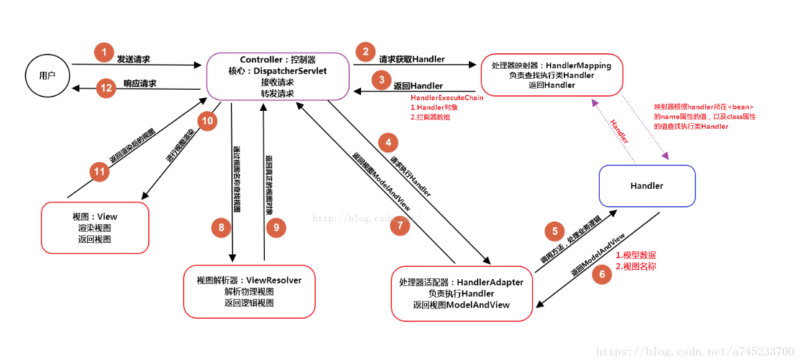

# 什么是Spring MVC 

Spring MVC是一个基于Java的实现了MVC设计模式的请求驱动类型的轻量级Web框架，通过把Model，View，Controller分离，将web层进行职责解耦，把复杂的web应用分成逻辑清晰的几部分，简化开发

# SpringMVC的流程

（1）用户发送请求至前端控制器DispatcherServlet；

（2） DispatcherServlet收到请求后，调用HandlerMapping处理器映射器，请求获取Handle；

（3）处理器映射器根据请求url找到具体的处理器，生成处理器对象及处理器拦截器(如果有则生成)一并返回给DispatcherServlet；

（4）DispatcherServlet 调用 HandlerAdapter处理器适配器；

（5）HandlerAdapter 经过适配调用 具体处理器(Handler，也叫后端控制器)；

（6）Handler执行完成返回ModelAndView；

（7）HandlerAdapter将Handler执行结果ModelAndView返回给DispatcherServlet；

（8）DispatcherServlet将ModelAndView传给ViewResolver视图解析器进行解析；

（9）ViewResolver解析后返回具体View；

（10）DispatcherServlet对View进行渲染视图（即将模型数据填充至视图中）

（11）DispatcherServlet响应用户。



# Spring MVC的主要组件

（1）前端控制器 DispatcherServlet（不需要程序员开发）

作用：接收请求、响应结果，相当于转发器，有了DispatcherServlet 就减少了其它组件之间的耦合度。

（2）处理器映射器HandlerMapping（不需要程序员开发）

作用：根据请求的URL来查找Handler

（3）处理器适配器HandlerAdapter

注意：在编写Handler的时候要按照HandlerAdapter要求的规则去编写，这样适配器HandlerAdapter才可以正确的去执行Handler。

（4）处理器Handler（需要程序员开发）

（5）视图解析器 ViewResolver（不需要程序员开发）

作用：进行视图的解析，根据视图逻辑名解析成真正的视图（view）

（6）视图View（需要程序员开发jsp）

View是一个接口， 它的实现类支持不同的视图类型（jsp，freemarker，pdf等等）

# SpringMVC常用的注解

@RequestMapping：用于处理请求 url 映射的注解，可用于类或方法上。用于类上，则表示类中的所有响应请求的方法都是以该地址作为父路径。

@RequestBody：注解实现接收http请求的json数据，将json转换为java对象。

@ResponseBody：注解实现将conreoller方法返回对象转化为json

# 导入架包

commons-logging-1.1.1.jar

spring-aop-4.0.0.RELEASE.jar

spring-beans-4.0.0.RELEASE.jar

spring-context-4.0.0.RELEASE.jar

spring-core-4.0.0.RELEASE.jar

spring-expression-4.0.0.RELEASE.jar

spring-web-4.0.0.RELEASE.jar

spring-webmvc-4.0.0.RELEASE.jar

# web.xml配置

```xml
<servlet>
	<servlet-name>dispatcherServlet</servlet-name>
	<servlet-class>org.springframework.web.servlet.DispatcherServlet</servlet-class>
	<!-- 配置DispatcherServlet 初始化配置参数 即配置文件路径 -->
	<init-param>
		<param-name>contextConfigLocation</param-name>
		<param-value>classpath:springmvc.xml</param-value>
	</init-param>
	<load-on-startup>1</load-on-startup>
</servlet>
<!--拦截所有请求-->
<servlet-mapping>
	<servlet-name>dispatcherServlet</servlet-name>
	<url-pattern>/</url-pattern>
</servlet-mapping>
```

# springmvc.xml配置

```xml
<beans xmlns="http://www.springframework.org/schema/beans"
			xmlns:xsi="http://www.w3.org/2001/XMLSchema-instance"
			xmlns:context="http://www.springframework.org/schema/context"
			xmlns:mvc="http://www.springframework.org/schema/mvc"
			xsi:schemaLocation="http://www.springframework.org/schema/beans http://www.springframework.org/schema/beans/spring-beans.xsd
				http://www.springframework.org/schema/context http://www.springframework.org/schema/context/spring-context-4.0.xsd
				http://www.springframework.org/schema/mvc http://www.springframework.org/schema/mvc/spring-mvc-4.0.xsd">
			
	<!-- 扫描注解的包 -->
	<context:component-scan base-package="com.wei"></context:component-scan>
			
	<!-- 配置视图解析器，返回值会通过视图解析器解析为实际的物理视图，视图解析器会解析为 prefix+returnVal+suffix,然后做转发操作 -->
	<bean class="org.springframework.web.servlet.view.InternalResourceViewResolver">
		<property name="prefix" value="/WEB-INF/views/"></property>
		<property name="suffix" value=".jsp"></property>
	</bean>
</beans>
```

# @requestMapping映射

## 支持ant风格资源请求地址支持3中方式

| 通配符          | 说明                                   |
| --------------- | -------------------------------------- |
| ?               | 匹配文件名中的一个字符                 |
| *               | 匹配文件名中任意多个字符               |
| **              | 匹配多层路径                           |
| /user/*/create  | 匹配/user/aaa/create、/user/bbb/create |
| /user/**/create | 匹配/user/aaa/bbb/create               |
| /user/create??  | 匹配/user/createaa                     |

## @PathVariable

@PathVariable映射URL绑定的占位符

是REST风格的URL，可以用占位符的方式携带参数

@PathVariable("xxx") String xxx 与URL中的{xxx}的参数名必须相同

```java
@RequestMapping("/test/{number}")
public String testPathVariable(@PathVariable("number") String number){
    return number；
}
```


## REST风格请求

### 1.web.xml必须配置

```xml
<filter>
	<filter-name>HiddenHttpMethodFilter</filter-name>
	<filter-class>org.springframework.web.filter.HiddenHttpMethodFilter</filter-class>
</filter>
		  
<filter-mapping>
	<filter-name>HiddenHttpMethodFilter</filter-name>
	<url-pattern>//*</url-pattern>
</filter-mapping>
```

### 2.form表单修改

```jsp
<!-- HTTP Delete 请求方式 -->
<form action="testRest" method="post">
	<input type="hidden" name="_method" value="DELETE"/>
	<input type="submit" value="testRest delete">
</form>
```

### 3.controller - method修改

```java
@RequestMapping(value="/testRest/{name}",method=RequestMethod.DELETE)
public String testRestDELETE(@PathVariable("name") String name) {
	System.out.println("testRestDELETE"+name);
	return  SUCCESS;
}
```

# @RequestParam

controlle中获取key=value形式的参数

@RequestParam GET POST 请求都可使用

value为请求参数的参数名 即key

required请求参数是否必须，默认true

defaultValue请求参数默认值

```java
public String testRequestParam(@RequestParam(value="user",required=true ,defaultValue="haha") String user){}
```

# servlet原生的API

可使用servlet原生的API作为方法参数

可以支持 HttpServletRequest、httpServletResponse httpsession Principal locale inputStream outputStream Reader writer

```java
@RequestMapping(value="/testRest",method=RequestMethod.POST)
public void test(Writer out){
	out.writer("hello");
}
```

# ModelAndView

springMVC将ModelAndView中model的数据遍历出来放进request域中即request.setAttribute(modelName,modelValue)

# 使用Map处理数据模型

springMVC 可以使用Map处理来接收参数数据模型

Map必须是方法参数进行传入的，不可自定义为HashMap类型

map会被转化为org.springframework.validation.support.BindingAwareModelMap

map中的值最终会被放入请求域对象中即request.setAttribute(modelName,modelValue)中

```java
@RequestMapping(value="/testMap",method=RequestMethod.POST)
public Map<String, Object > testMap(Map<String, Object > map) {
    map.put("name","haha");
    return map;
}
```

# @SessionAttributes

@SessionAttributes作用在类上，将需要的信息保存在session中，便于缓存使用

| 属性             | 说明                                                |
| ---------------- | --------------------------------------------------- |
| value  String[]  | 要保存在session中的属性的名字 可以是多个，以","分开 |
| types Class<?>[] | 要保存在session中的属性的类名 可以是多个，以","分开 |

# @ModelAttribute

该注解标注的方法，每个接口请求时都会先调用

也可以来修饰目标方法，POJO 类型的入参其 value 属性值有如下的作用:

1). SpringMVC 会使用 value 属性值在 implicitModel 中查找对应的对象, 若存在则会直接传入到目标方法的入参中.

2). SpringMVC 会以 value 为 key, POJO 类型的对象为 value, 存入到 request 中. 

运行流程:

1. 执行 @ModelAttribute 注解修饰的方法: 从数据库中取出对象, 把对象放入到了 Map 中. 键为: user
2. SpringMVC 从 Map 中取出 User 对象, 并把表单的请求参数赋给该 User 对象的对应属性.
3. SpringMVC 把上述对象传入目标方法的参数. 

# springmvc From标签

1.导入标签

```jsp
<%@ taglib prefix="form" uri="http://www.springframework.org/tags/form" %>
```

2.form标签的modelAttribute属性

form标签必须填写modelAttribute 属性指定绑定的模型属性，若没有指定该属性，则默认从 request 域对象中读取 command 的表单 bean如果该属性值也不存在，则会发生错误。

# SpringMVC 处理静态资源

在springMVC.xml配置文件中添加配置

```xml
<mvc:default-servlet-handler/>
<mvc:annotation-driven />
```

default-servlet-handler 将在 SpringMVC 上下文中定义一个 DefaultServletHttpRequestHandler,它会对进入 DispatcherServlet 的请求进行筛查, 如果发现是没有经过映射的请求, 就将该请求交由 WEB 应用服务器默认的Servlet 处理. 如果不是静态资源的请求，才由 DispatcherServlet 继续处理.

# mvc:annotation-driven

添加该标签会自动注册

| 自动注册类                        | 说明                                                         |
| --------------------------------- | ------------------------------------------------------------ |
| RequestMappingHandlerMapping      | 它会处理@RequestMapping 注解，并将其注册到请求映射表中       |
| RequestMappingHandlerAdapter      | 处理请求的适配器，确定调用哪个类的哪个方法，并且构造方法参数，返回值。 |
| ExceptionHandlerExceptionResolver | 异常处理类                                                   |

并支持

@NumberFormat、@DateTimeFormat、@ResponseBody、@RequestBody注解

# @InitBinder

作用:可以对请求参数进行初始化解析到WebDataBinder中

@InitBinder标注的方法只能是void，参数通常是WebDataBinder

# 文件上传

添加文件上传的包

```JAVA
commons-fileupload-1.2.1.jar
commons-io-2.0.jar
```

在springMVC配置文件中添加配置

```xml
<bean id="multipartResolver"
		class="org.springframework.web.multipart.commons.CommonsMultipartResolver">
	<property name="defaultEncoding" value="UTF-8"></property>
	<property name="maxUploadSize" value="1024000"></property>	
</bean>
```

controller接收文件

```java
@RequestMapping(value="/testuploadFile",method=RequestMethod.POST)
public String testuploadFile(@RequestParam("desc") String desc, @RequestParam("file") MultipartFile file) throws IOException {
		System.out.println("desc："+desc);
		System.out.println("file："+file.getOriginalFilename());
		System.out.println("file："+file.getInputStream());
		return SUCCESS;
}
```

# 拦截器

## 1.必须实现HandlerInterceptor接口

```java
public void preHandle(){}
目标方法调用之前调用，返回false则不会调用后续的拦截器和目标方法
public void postHandle(){}
目标方法调用之后响应用户之前
public void afterCompletion(){}
目标方法调用之后响应用户之后调用，清理资源
```

## 2.spring配置文件中添加配置

```xml
<mvc:interceptors>
	<bean id="firstInterceptor" class="com.wei.interceptor.FirstInterceptor"></bean>
</mvc:interceptors>
```

## 3.拦截器配置

```xml
<mvc:interceptors>
	<bean id="firstInterceptor" class="com.wei.interceptor.FirstInterceptor"></bean>
	<mvc:interceptor>
		<mvc:mapping path="/emps"/>
		<bean class="com.wei.interceptor.SecondInterceptor"></bean>
	</mvc:interceptor>
</mvc:interceptors>
		
<mvc:mapping path="/emps"/> 配置映射路径 
<bean class="com.wei.interceptor.SecondInterceptor"></bean> 映射路径所对用的拦截器
```

## 拦截器的执行顺序

first-preHandle --> Second-preHandle --> 目标方法 --> Second-postHandle --> first-postHandle --> 
dispatcherServlet --> Second-afterCompletion --> first-afterCompletion

# 异常处理

springMVC通过HandlerExceptionResolver处理异常，springmvc实现了三种:

ExceptionHandlerExceptionResolver
ResponseStatusExceptionResolver
DefaultHandlerExceptionResolver

## ExceptionHandlerExceptionResolver

### 使用@ExceptionHandler注解

在controller中使用该注解统一处理异常信息，若有多个@ExceptionHandler标注的方法，则按照异常的优先级进行匹配，异常匹配度高的优先级越高

```java
@ExceptionHandler(value= {RuntimeException.class})
	public ModelAndView errorExceptionHandler(Exception e) {
//	public String errorExceptionHandler(Exception e) {
		System.out.println(e);
		ModelAndView mv = new ModelAndView("error");
		mv.addObject("exception", e);
		return mv;
	//		return "error";
}
```

将exception信息放进ModelAndView中存储到request域中，进行页面信息提示

### 使用@ControllerAdvice注解

需配合与@ExceptionHandler注解一起使用

```java
@ControllerAdvice
public class ErrorExceptionHandler {		
	@ExceptionHandler(value= {RuntimeException.class})
	public ModelAndView errorExceptionHandler(Exception e) {
		System.out.println(e);
		ModelAndView mv = new ModelAndView("error");
		mv.addObject("exception", e);
		return mv;
	}
}
```

若当前handler中找不到@ExceptionHandler方法来处理当前方法出现异常，则去@ControllerAdvice标注的类中的@ExceptionHandler的方法查找是否可以处理当前异常。

## ResponseStatusExceptionResolver

使用@ResponseStatus处理http相应的动态码

```java
@ResponseStatus(value=HttpStatus.BAD_REQUEST,reason="请求参数错误")
public class ErrorResponseSatueException extends RuntimeException{
	private static final long serialVersionUID = 1L;
}
```

## SimpleMappingExceptionResolver

可以在配置文件中配置出现异常并需要展现错误信息的页面提示

```xml
<bean class="org.springframework.web.servlet.handler.SimpleMappingExceptionResolver">
    <property name="exceptionMappings">
        <props>
            <prop key="java.lang.ArrayIndexOutOfBoundsException">error</prop>
        </props>
    </property>
</bean>
```