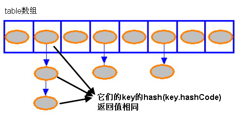
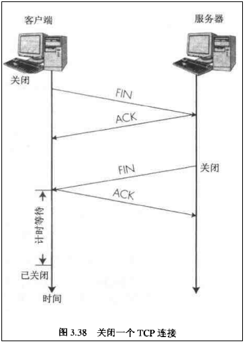
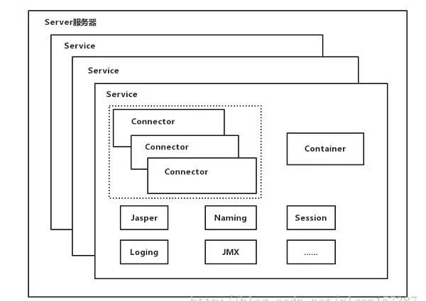
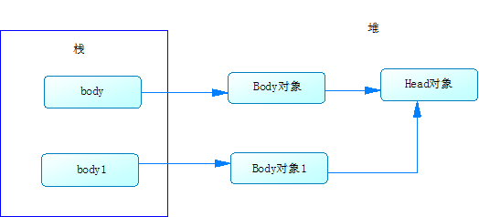

# 常量池、栈、堆的比较

​	JAVA中，有六个不同的地方可以存储数据，对于栈和常量池中的对象可以共享，对于堆中的对象不可以共享。

## 栈

​	存放基础类型的变量数据和java对象的引用。JAVA编译器需知道存储在栈内的所有数据的大小和生命周期。当没有引用指向数据时，这个数据就会消失。

## 堆

​	存放所有的JAVA对象，即使用new关键字创建的对象，堆进行存储需要一定的时间。堆中的对象的由垃圾回收器负责回收，因此大小和生命周期不需要确定，具有很大的灵活性。

## 静态域

​	存放静态成员（static定义的）

## 常量池

​	存放字符串常量和基础类型常量（public static final）。String s1 = "china";  这种创建的数据，就存储在常量池中，String ss1 = new String("china");存储在堆中，对于equals相等的字符串，在常量池中永远只有一份，在堆中有多份。

```java
String s1 = "china";
String s2 = "china";
String s3 = "china";
String ss1 = new String("china");
String ss2 = new String("china");
String ss3 = new String("china");
```


# HashMap

HashMap 是一个散列表，存储的内容是键值对(key-value)映射。

HashMap中的映射是无序的。

**线程不安全**。可以调用

```java
java.util.Collections#synchronizedMap(Map<K,V> m)
 public static <K,V> Map<K,V> synchronizedMap(Map<K,V> m) {
        return new SynchronizedMap<>(m);
    }
```

将非线程安全改为线程安全的

key、value都可以为null。

**通过“拉链法”解决哈希冲突的**。

## 继承-实现关系

```java
public class HashMap<K,V> extends AbstractMap<K,V> implements Map<K,V>, Cloneable, Serializable
```


## 构造函数

```java
// 默认构造函数。
HashMap()
    //使用默认的初始容量
   static final int DEFAULT_INITIAL_CAPACITY = 16;
   // 默认加载因子
   static final float DEFAULT_LOAD_FACTOR = 0.75f;
// 指定“容量大小”的构造函数
HashMap(int capacity)
    // 默认加载因子
   static final float DEFAULT_LOAD_FACTOR = 0.75f;
// 指定“容量大小”和“加载因子”的构造函数
HashMap(int capacity, float loadFactor)
// 包含“子Map”的构造函数
HashMap(Map<? extends K, ? extends V> map)
```

## 重要的成员变量

table是一个Entry[]数组类型，而Entry实际上就是一个单向链表。哈希表的"key-value键值对"都是存储在Entry数组中的。 
size是HashMap的大小，它是HashMap保存的键值对的数量。 
threshold是HashMap的阈值，用于判断是否需要调整HashMap的容量。threshold的值="容量*加载因子"，当HashMap中存储数据的数量达到threshold时，就需要将HashMap的容量加倍。
loadFactor就是加载因子。 
modCount修改次数,对HashMap 内容的修改将增加这个值，是用来实现fail-fast机制的。在迭代过程中，判断 modCount 跟迭代时生成的 expectedModCount的值是否相等，不相等则表示已有其他线程修改了该Map，就会抛出ConcurrentModificationException异常，modCount 声明为 volatile，保证线程之间修改的可见性.

```java
void                 clear() //通过将所有的元素设为null来实现
Object               clone()
//首先通过getEntry(key)获取key对应的Entry，getEntry(key)判断key的hashcode在table中是否存在，如果存在则判断存在table中的key与当前key是否相等
boolean              containsKey(Object key)
boolean              containsValue(Object value)
Set<Entry<K, V>>     entrySet()
V                    get(Object key)
boolean              isEmpty()
Set<K>               keySet()
V                    put(K key, V value)
void                 putAll(Map<? extends K, ? extends V> map)
V                    remove(Object key)
int                  size()
Collection<V>        values()
```

## 造成哈希冲突原因

```java
  
static int indexFor(int h, int length) {
     return h & (length-1);
}

public V put(K key, V value) {
        // 若“key为null”，则将该键值对添加到table[0]中。
        if (key == null)
            return putForNullKey(value);
        // 若“key不为null”，则计算该key的哈希值，然后将其添加到该哈希值对应的链表中。
        int hash = hash(key.hashCode());
        int i = indexFor(hash, table.length);
        for (Entry<K,V> e = table[i]; e != null; e = e.next) {
            Object k;
            // 若“该key”对应的键值对已经存在，则用新的value取代旧的value。然后退出！
            if (e.hash == hash && ((k = e.key) == key || key.equals(k))) {
                V oldValue = e.value;
                e.value = value;
                e.recordAccess(this);
                return oldValue;
            }
        }

        // 若“该key”对应的键值对不存在，则将“key-value”添加到table中
        modCount++;
        addEntry(hash, key, value, i);
        return null;
    }


    // 新增Entry。将“key-value”插入指定位置，bucketIndex是位置索引。
    void addEntry(int hash, K key, V value, int bucketIndex) {
        // 保存“bucketIndex”位置的值到“e”中
        Entry<K,V> e = table[bucketIndex];
        // 设置“bucketIndex”位置的元素为“新Entry”，
        // 设置“e”为“新Entry的下一个节点”
        table[bucketIndex] = new Entry<K,V>(hash, key, value, e);
        // 若HashMap的实际大小 不小于 “阈值”，则调整HashMap的大小
        if (size++ >= threshold)
            resize(2 * table.length);
    }

```


在hashmap中添加数据时，即put(K key,V value)，HashMap根据key的hashcode来决定将Entry实例存放在table中的哪个位置【 int i = indexFor(hash, table.length);】，当key的hashcode相同时，则会出现hash冲突。

使用单链表解决hash冲突的问题，当hashcode存在时，将当前bucketIndex的值存放在新创建的Entry的链表上，然后将新创建的Entry放在 table[bucketIndex] 中。



JDK 1.8后修改

1.table类型改为Node<K,V>[] table

2.table初始化由原来的在HashMap构造方法中创建修改为在put<Key,Value>时判断table为空和table.length=0再进行初始化

3.Entry单链表会出现拉链过长的情况，一旦出现拉链过长，则会严重影响HashMap的性能。1.8引入了红黑树，当链表长度>8时链表就转换为红黑树，利用红黑树快速增删改查的特点提高HashMap的性能。

# Hashtable

​	Hashtable 是一个**散列表**，它存储的内容是**键值对(key-value)映射**。Hashtable 的函数都是**同步的**，它是线程安全的。它的key、value都不可以为null。Hashtable中的映射是无序的。通过**拉链法**解决哈希冲突的。

## 继承-实现关系

```java
public class Hashtable<K,V>
    extends Dictionary<K,V>
    implements Map<K,V>, Cloneable, java.io.Serializable {}
```

## 构造函数

```java
// 默认构造函数。
public Hashtable() 
	int initialCapacity = 16;
	float loadFactor = 0.75f;
	
// 指定“容量大小”的构造函数
public Hashtable(int initialCapacity) 
	float loadFactor = 0.75f;

// 指定“容量大小”和“加载因子”的构造函数
public Hashtable(int initialCapacity, float loadFactor) 

// 包含“子Map”的构造函数
public Hashtable(Map<? extends K, ? extends V> t)
    int initialCapacity = Math.max(2*t.size(), 11);
	float loadFactor = 0.75f;
```

## 重要的成员变量

**table** 是一个Entry[]数组类型，而Entry实际上就是一个单向链表。哈希表的"key-value键值对"都是存储在Entry数组中的。

**count**是Hashtable的大小，它是Hashtable保存的键值对的数量。 

**threshold**是Hashtable的阈值，用于判断是否需要调整Hashtable的容量。threshold的值="容量*加载因子"。

**loadFactor**就是加载因子。 

**modCount**修改次数,对HashMap 内容的修改将增加这个值，是用来实现fail-fast机制的。在迭代过程中，判断 modCount 跟迭代时生成的 expectedModCount的值是否相等，不相等则表示已有其他线程修改了该Map，就会抛出ConcurrentModificationException异常，modCount 声明为 volatile，保证线程之间修改的可见性.

## API

```java
synchronized void                clear()
synchronized Object              clone()
             boolean             contains(Object value)
synchronized boolean             containsKey(Object key)
synchronized boolean             containsValue(Object value)
synchronized Enumeration<V>      elements()
synchronized Set<Entry<K, V>>    entrySet()
synchronized boolean             equals(Object object)
synchronized V                   get(Object key)
synchronized int                 hashCode()
synchronized boolean             isEmpty()
synchronized Set<K>              keySet()
synchronized Enumeration<K>      keys()
synchronized V                   put(K key, V value)
synchronized void                putAll(Map<? extends K, ? extends V> map)
synchronized V                   remove(Object key)
synchronized int                 size()
synchronized String              toString()
synchronized Collection<V>       values()
```

## 造成哈希冲突原因

与HashMap 相同


# http安全性幂等行

## 安全性

​	**一次请求或多次请求对数据资源不造成影响，即为安全**

​	例如：GET  GET请求获取数据资源，只是查看而不对数据进行操作即为安全。 DELETE  DELETE请求删除数据资源，对数据资源造成了影响，即为不安全，同理POST PUT等 。

## 幂等性

​	一次请求或多次相同请求所达到的目的(对数据造成的影响)一致.

| 请求方式 | 请求地址 | 描述                                                         | 幂等   |
| :------- | :------- | :----------------------------------------------------------- | :----- |
| GET      | /emp     | 多次获取相同数据，不会对数据造成影响                         | 幂等   |
| PUT      | /emp/5   | 对要修改的数据进行修改，一次多次执行修改对数据的影响相同，目的是将该条数据修改为请求数据 | 幂等   |
| DELETE   | /emp/5   | 对要删除的数据进行删除，一次多次执行删除对数据的影响相同，目的是将该条数据删除 | 幂等   |
| POST     | /emp     | 插入数据，一次执行及插入一条数据，多次执行则插入多条，对数据造成的影响不同 | 不幂等 |


# TCP和UDP

## TCP

​	Transmission Control Protocol，传输控制协议，是面向连接的协议。TCP连接时，三次握手，断开时，四次挥手。三次握手（类似打电话），A：喂 （此时A不能确定B是否能接通），B：喂（此时B听到了A的谈话，但不能确定自己说的A是否能正常接收到），A：“B，你好”（此时A收到了B的回复，给B回复能正常接听），谈话开始.


四次挥手



四次挥手时，主动断开方与被动断开方状态


此时客户端为主动断开方，服务端为被动断开方,在tcp进行四次挥手时主动断开方与被动端开方状态转移图

## UDP

​	UDP（User Data Protocol），用户数据报协议，UDP是一个非连接的协议，不需要维护连接状态。UDP尽最大努力交付，不保证可靠交付。UDP是面向报文的。ping命令的原理就是向对方主机发送UDP数据包。

## TCP和UDP区别

|            | TCP          | UDP        |
| ---------- | ------------ | ---------- |
| 是否连接   | 面向连接     | 面向非连接 |
| 传输可靠性 | 可靠         | 不可靠     |
| 应用场合   | 传输大量数据 | 少量数据   |
| 速度       | 慢           | 快         |

## Socket连接

socket是一个五元组，包括[源IP:源端口,TCP,目的IP:目的端口]这个五元组，即标识了一条可用的连接。

## TIME_WAIT作用

防止前一个连接上延迟的数据包或者丢失重传的数据包，被后面复用的连接错误的接收

# SimpleDateFormat

参考网址：https://www.cnblogs.com/java1024/p/8594784.html

## 集成关系

```java
public class SimpleDateFormat extends DateFormat {...}
```

## 造成线程不安全的原因

DateFormat类中有成员变量

```java
protected Calendar calendar;
```

在SimpleDateFormat进行format()时，使用同一个calendar变量进行时间设置，在多线程访问的情况下，则有问题。

源码：

```java
 private StringBuffer format(Date date, StringBuffer toAppendTo,
                                FieldDelegate delegate) {
        // Convert input date to time field list
        calendar.setTime(date);//此处会造成多线程访问线程不安全问题
        boolean useDateFormatSymbols = useDateFormatSymbols();

        for (int i = 0; i < compiledPattern.length; ) {
            int tag = compiledPattern[i] >>> 8;
            int count = compiledPattern[i++] & 0xff;
            if (count == 255) {
                count = compiledPattern[i++] << 16;
                count |= compiledPattern[i++];
            }

            switch (tag) {
            case TAG_QUOTE_ASCII_CHAR:
                toAppendTo.append((char)count);
                break;

            case TAG_QUOTE_CHARS:
                toAppendTo.append(compiledPattern, i, count);
                i += count;
                break;

            default:
                subFormat(tag, count, delegate, toAppendTo, useDateFormatSymbols);
                break;
            }
        }
        return toAppendTo;
    }
```

## 解决方案

借用**ThreadLocal**类

代码实现：

```java
public class ConcurrentDateUtil {	
	private static ThreadLocal<DateFormat> threadLocal = new ThreadLocal<DateFormat>() {
			@Override
			protected DateFormat initialValue() {
				return new SimpleDateFormat("yyyy-MM-dd HH:mm:ss");
			}
		};

		public static Date parse(String dateStr) throws ParseException {
			return threadLocal.get().parse(dateStr);
		}

		public static String format(Date date) {
			return threadLocal.get().format(date);
		}
}
```
# ThreadLocal

## 与Thread关系

Thread中定义了ThreadLocal.ThreadLocalMap 类型的私有变量

```java
public class Thread implements Runnable {
    //Thread中定义了ThreadLocal.ThreadLocalMap 类型的变量
    ThreadLocal.ThreadLocalMap threadLocals = null;
    ...
}
```

## ThreadLocalMap

ThreadLocalMap是ThreadLocal内部类

```java
public class ThreadLocal<T> {
	static class ThreadLocalMap {....}    
}
```

## ThreadLocal方法

### initialValue

```java
 protected T initialValue() {
        return null;
    }
```

### get

调用ThreadLocal中的get()方法，获取本线程的ThreadLocalMap threadLocals变量，如果threadLocals为空，空则调用setInitialValue()方法。如果threadLocals不为空，则获取threadLocals中以当前ThreadLocal对象为key的单链表Entry实例e，e不为空则返回e.value，e为空则调用setInitialValue()方法

```java
public T get() {
    Thread t = Thread.currentThread();
    ThreadLocalMap map = getMap(t);
    if (map != null) {
        ThreadLocalMap.Entry e = map.getEntry(this);
        if (e != null) {
            @SuppressWarnings("unchecked")
            T result = (T)e.value;
            return result;
        }
    }
    return setInitialValue();
}
```

### getMap(Thread t)

返回当前线程的ThreadLocalMap threadLocals变量

```java
ThreadLocalMap getMap(Thread t) {
    return t.threadLocals;
}
```

### setInitialValue

在调用ThreadLocal中的get()方法是ThreadLocalMap map为空或map中get(key)为空则调用setInitialValue()方法

现获取初始化方法initialValue() v1中的值，若map不为空则将v1 set进map中，若map为空，则创建map并将v1 set 进map中

```java
private T setInitialValue() {
    T value = initialValue();
    Thread t = Thread.currentThread();
    ThreadLocalMap map = getMap(t);
    if (map != null)
        map.set(this, value);
    else
        createMap(t, value);
    return value;
}
```

### createMap

```java
void createMap(Thread t, T firstValue) {
    t.threadLocals = new ThreadLocalMap(this, firstValue);
}
```

# tomcat

## Tomcat顶层架构

tomcat顶层结构图



从上图可以看出一个Tomcat中只有一个Server，一个Server可以包含多个Service，一个Service只有一个Container，但是可以有多个Connectors，这是因为一个服务可以有多个连接，如同时提供Http和Https链接，也可以提供向相同协议不同端口的连接，多个 Connector 和一个 Container 就形成了一个 Service

Connector用于接受请求并将请求封装成Request和Response来具体处理；

Container用于封装和管理Servlet，以及具体处理request请求；

## Connector的结构

Connector结构图


​	Connector
​		-ProtocolHandler
​			-Endpoint
​				-Acceptor(用于监听请求)
​				-AsyncTimeout(用于检查异步Request的超时)
​				-Handler(Handler用于处理接收到的Socket，在内部调用Processor进行处理)
​			-Processor
​			-Adapter

​	ProtocolHandler处理请求，不同的ProtocolHandler代表不同的连接类型，比如：Http11Protocol使用的是普通Socket来连接的，Http11NioProtocol使用的是NioSocket来连接的。

​	Endpoint用来处理底层Socket的网络连接,用来实现TCP/IP协议的。

​	Processor用于将Endpoint接收到的Socket封装成Request,用来实现HTTP协议的。

​	Adapter用于将Request交给Container进行具体的处理,将请求适配到Servlet容器进行具体的处理。

## Container架构

Container架构图


Engine：引擎，用来管理多个站点，一个Service最多只能有一个Engine；

Host：代表一个站点，也可以叫虚拟主机，通过配置Host就可以添加站点；整个webapps就是一个Host站点。

Context：代表一个应用程序，对应着平时开发的一套程序，或者一个WEB-INF目录以及下面的web.xml文件；

Wrapper：每一Wrapper封装着一个Servlet；

​	Container处理请求是使用责任链模式(Pipeline-Valve)。责任链模式是指在一个请求处理的过程中有很多处理者依次对请求进行处理，每个处理者负责做自己相应的处理，处理完之后将处理后的请求返回，再让下一个处理者继续处理。

Container责任链调用流程：

​	EngineValve1...->StandardEngineValve->HostValve1...StandardHostValve->ContextValve1...StandardContextValve->WrapperValve1...->StandardWrapperValve

​	当执行到StandardWrapperValve的时候，会在StandardWrapperValve中创建FilterChain，并调用其doFilter方法来处理请求，这个FilterChain包含着我们配置的与请求相匹配的Filter和Servlet，其doFilter方法会依次调用所有的Filter的doFilter方法和Servlet的service方法，这样请求就得到了处理！

​	当所有的Pipeline-Valve都执行完之后，并且处理完了具体的请求，这个时候就可以将返回的结果交给Connector了，Connector在通过Socket的方式将结果返回给客户端。

# Object

Java最基础和核心的类，在编译时会自动导入；

## hashCode()

```java
public native int hashCode();
```

hashCode根据一定的规则和对象相关的信息生成的一个散列值；

重写hashCode()方法的基本规则：

​	同一个对象多次调用hashCode()，返回的值应相同；

​	两个对象通过equals()比较相同时，hashCode()返回的值也应相同

## equals(Object obj)

```java
public boolean equals(Object obj) 
```

​	比较两个对象的内存地址是否相等

## toString()

```java
public String toString() {
		return getClass().getName() + "@" + Integer.toHexString(hashCode());
	}
```

## finalize()

```java
protected void finalize() throws Throwable { }
```

垃圾回收器准备释放内存的时候，会先调用finalize()。

(1).对象不一定会被回收。

 (2).垃圾回收不是析构函数。

(3).垃圾回收只与内存有关。

 (4).垃圾回收和finalize()都是靠不住的，只要JVM还没有快到耗尽内存的地步，它是不会浪费时间进行垃圾回收的。

## clone()

```java
protected native Object clone() throws CloneNotSupportedException;
```

快速创建一个已有对象的副本

Object.clone()方法返回一个Object对象

clone方法首先会判对象是否实现了Cloneable接口，若无则抛出CloneNotSupportedException

object类默认的拷贝为浅拷贝

### 浅拷贝

最终指向了源对象属性的地址

```java
				static class Body implements Cloneable{
					public Head head;
					@Override
					protected Object clone() throws CloneNotSupportedException {
						return super.clone();
					}
				}
				static class Head /*implements Cloneable*/{
					public  Face face;
					public Head() {}
					public Head(Face face){this.face = face;}
				} 
```

Body重写clone()，Head不重写clone()



### 不彻底的深拷贝

```java
static class Body implements Cloneable{
					public Head head;
					@Override
					protected Object clone() throws CloneNotSupportedException {
						return super.clone();
					}
				}
				static class Head /*implements Cloneable*/{
					public  Face face;
					public Head() {}
					public Head(Face face){this.face = face;}
					@Override
					protected Object clone() throws CloneNotSupportedException {
						return super.clone();
					}
				} 
				static class Face{}
```

Body重写clone()，Head重写clone() Face不重写clone()


### 深拷贝

```java

				static class Body implements Cloneable{
					public Head head;
					@Override
					protected Object clone() throws CloneNotSupportedException {
						return super.clone();
					}
				}
				static class Head /*implements Cloneable*/{
					public  Face face;
					public Head() {}
					public Head(Face face){this.face = face;}
					@Override
					protected Object clone() throws CloneNotSupportedException {
						return super.clone();
					}
				} 
				static class Face{
					@Override
					protected Object clone() throws CloneNotSupportedException {
						return super.clone();
					}
				}
```

Body重写clone()，Head重写clone() Face重写clone()


# try-catch-finally

```java
private int doTry() {
    int x = 1;
    try {
        return ++x;
    } catch (Exception e) {
    } finally {
        ++x;
        System.out.println("finally - " + x);
    }
    return x;
}

@Test
public void doTryTest(){
    int i = doTry();
    System.out.println(i);
}
打印结果:
finally - 3
2
```

在try-catch-finally代码块中不管try中是否有break,return 等都会执行finally模块。也就是说，return前会执行finally语句。执行完finally语句才执行 return。

如果try语句里有return，那么代码的行为如下：
1.如果有返回值，就把返回值保存到局部变量中
2.执行到finally语句里执行
3.执行完finally语句后，返回之前保存在局部变量表里的值

# String Replace

## replace-char

替换单个字符

```java
public String replace(char oldChar, char newChar) {...}
```

## replace-CharSequence

替换字符串

```java
 public String replace(CharSequence target, CharSequence replacement) {
        return Pattern.compile(target.toString(), Pattern.LITERAL).matcher(
                this).replaceAll(Matcher.quoteReplacement(replacement.toString()));
    }
```

## replaceAll

可根据正则表达式进行字符串替换

```java
 public String replaceAll(String regex, String replacement) {
        return Pattern.compile(regex).matcher(this).replaceAll(replacement);
    }
```

## replaceFirst

可根据正则表达式进行字符串替换第一次出现的字符

```java
 public String replaceFirst(String regex, String replacement) {
        return Pattern.compile(regex).matcher(this).replaceFirst(replacement);
    }
```

# JVM

JAVA的JVM的内存可分为3个区：堆(heap)、栈(stack)和方法区(method)

## 堆区

1.存储的全部是对象，每个对象都包含一个与之对应的class的信息。(class的目的是得到操作指令)

2.jvm只有一个堆区(heap)被所有线程共享，只存放对象本身

3.堆是一个不连续的内存空间，分配灵活，速度慢!

## 栈区

- 方法执行的内存模型。`每个方法被调用都会创建一个栈帧`（存储局部变量、操作数、方法出口等）。
- `JVM为每个线程创建一个栈`，用于存放该线程执行方法的信息（实际参数、局部变量等）。
- 栈属于线程私有，不能实现线程间的共享！
- 栈的存储特性是“先进后出，后进先出”。
- 栈是由系统自动分配，速度快！栈是一个连续的内存空间（相比于堆）。

## 方法区（特殊的堆）

JVM只有一个方法区，被所有线程共享！

方法区实际也是堆，只是用于存储类、常量相关的信息！

用来存放程序中永远不变或唯一的内容（类信息{Class对象}、静态变量、字符串常量等）。

```java
public class Dog{
    private String name;
    public Dog(String name){
        this.name = name;
    }
}

public String Person{
    private String name;
    private int age;
    private Dog dog;
    public Person(int age,String name){
        this.age = age;
        this.name = name;
    }
    
    public void play(){
        System.out.println("play with" + this.dog.name);
    }
}

public class Test(){
    public static void main(String[] args){
        Person p = new Person(18,"惊欢");
        p.dog = new Dog("董岩");
        p.play();
    }
}
```

jvm加载对象流程图


# switch表达式支持的类型

JDK1.6（及之前版本）支持byte,char,short,int

JDK1.7新特性支持了String类型

# 静态代码块-代码块-构造方法

```java
 class F {
    static {
        System.out.print("F-S{} ");
    }

    {
        System.out.print("F{} ");
    }

    F() {
        System.out.print("F() ");
    }
}

 class S extends F {
    static {
        System.out.print("S-S{} ");
    }

    {
        System.out.print("S{} ");
    }

    S() {
        System.out.print("S() ");
    }

    public static void main(String[] args) {
        System.out.print("S-M() ");
        new S(); //F-S{} S-S{} S-M() F{} F() S{} S()
    }
}
```

1.加载子类S的class文件时，先加载父类F的class文件，

2.加载class文件时，先执行F类的static{}静态代码块，且静态代码块只在加载class文件时执行一次，

3.后加载子类S的class文件，加载S静态代码块，

4.为main方法分配栈帧，执行main方法

5.创建S对象先调用父类F的代码块，后调用F的构造方法

6.在调用S的代码块，后调用S的构造方法

7.代码块与构造方法类似，每次new对象时都会执行

# 集合

集合之间的集成与实现关系图


## collection接口

Collection依赖于Iterator，实现类需要实现iterator()函数

有List和Set两大分支

List有序队列

可根据索引进行检索，实现类有LinkedList，ArrayList，Vector，Stack

Set不允许有重复元素的集合

实现类有HastSet和TreeSet，HashSet通过HashMap实现，TreeSet通过TreeMap实现

## Map

映射接口，key-value键值对

AbstractMap是个抽象类，实现了Map接口中的大部分接口，HashMap，TreeMap，WeakHashMap都是继承于AbstractMap。Hashtable继承于Dictionary，并实现了Map接口。

## 工具类

Arrays，Collections，可进行操作数组、集合

# ArrayList

ArrayList是一个动态数组

ArrayList实现了RandmoAccess接口，RandmoAccess接口为标记接口，实现RandomAccess接口的的List可以通过简单的for循环来访问数据比使用iterator访问来的高效快速。

**线程不安全**。可以调用

```java
java.util.Collections#synchronizedList(java.util.List<T>)
    public static <T> List<T> synchronizedList(List<T> list) {
        return (list instanceof RandomAccess ?
                new SynchronizedRandomAccessList<>(list) :
                new SynchronizedList<>(list));
    }
```

将非线程安全改为线程安全的

## 继承与实现

```java
public class ArrayList<E> extends AbstractList<E>
        implements List<E>, RandomAccess, Cloneable, java.io.Serializable
```

## 构造函数

```java
public ArrayList() {
    //初始化 DEFAULTCAPACITY_EMPTY_ELEMENTDATA = {};
	this.elementData = DEFAULTCAPACITY_EMPTY_ELEMENTDATA;
}
//默认数组初始化容量=10
public ArrayList(int initialCapacity){...}
public ArrayList(@NotNull Collection<? extends E> c) {...}
```

## 重要的成员变量

elementData：Object[]类型的动态数组，elementData数组的大小会根据ArrayList容量的增长而动态的增长。

size：动态数组的实际大小

## 重要方法

add(E e)

```java
public boolean add(E e) {
    ensureCapacityInternal(size + 1);  // Increments modCount!!
    elementData[size++] = e;
    return true;
}

private void ensureCapacityInternal(int minCapacity) {
        if (elementData == DEFAULTCAPACITY_EMPTY_ELEMENTDATA) {
            minCapacity = Math.max(DEFAULT_CAPACITY, minCapacity);
        }

        ensureExplicitCapacity(minCapacity);
    }

private void ensureExplicitCapacity(int minCapacity) {
        modCount++;

        // overflow-conscious code
        if (minCapacity - elementData.length > 0)
            grow(minCapacity);
    }
private void grow(int minCapacity) {
        // overflow-conscious code
        int oldCapacity = elementData.length;
        int newCapacity = oldCapacity + (oldCapacity >> 1);
        if (newCapacity - minCapacity < 0)
            newCapacity = minCapacity;
        if (newCapacity - MAX_ARRAY_SIZE > 0)
            newCapacity = hugeCapacity(minCapacity);
        // minCapacity is usually close to size, so this is a win:
        elementData = Arrays.copyOf(elementData, newCapacity);
    }

Arrays中数组copy的方法
 public static <T,U> T[] copyOf(U[] original, int newLength, Class<? extends T[]> newType) {
        @SuppressWarnings("unchecked")
        T[] copy = ((Object)newType == (Object)Object[].class)
            ? (T[]) new Object[newLength]
            : (T[]) Array.newInstance(newType.getComponentType(), newLength);
        System.arraycopy(original, 0, copy, 0,
                         Math.min(original.length, newLength));
        return copy;
}
```

在向数组中添加数据时，先查看数组的(size+1)-length>0是否大于0，如果值大于0，表示当前数组已填满，数组长度需要扩充。将数组的大小调整为 int newCapacity = oldCapacity + (oldCapacity >> 1);创建一个新的数组，将原数组的数据copy到新的数组，将新的数组返回，然后将新的数组添加到数组当前size++的位置。

remove(int index)

```java
public E remove(int index) {
        rangeCheck(index);

        modCount++;
        E oldValue = elementData(index);

        int numMoved = size - index - 1;
        if (numMoved > 0)
            System.arraycopy(elementData, index+1, elementData, index,
                             numMoved);
        elementData[--size] = null; // clear to let GC do its work

        return oldValue;
    }
```

remove指定index的数据时，先获取当前数据之后的数据长度，将index+1之后的数据覆盖index之后的数据，即index+1之后的数据都向前移动一格，然后将索引为[--size]的值置为null。

clear()

```java
 public void clear() {
        modCount++;

        // clear to let GC do its work
        for (int i = 0; i < size; i++)
            elementData[i] = null;

        size = 0;
    }
```

使用for循环遍历数组，并将数组中的值都置为null

# CopyOnWriteArrayList

线程安全与ArrayList类似，CopyOnWriteArrayList在进行数据添加时，先将对象锁住，不允许其他线程调用add方法，将原数组copy到新的数组进行添加，然后将数组对象的引用指向新的数组，读取数据时不进行加锁

## 继承与实现

```java
public class CopyOnWriteArrayList<E>
    implements List<E>, RandomAccess, Cloneable, java.io.Serializable
```

## 构造函数

```java
public CopyOnWriteArrayList() {
        setArray(new Object[0]);
    }
public CopyOnWriteArrayList(Collection<? extends E> c) {...}
public CopyOnWriteArrayList(E[] toCopyIn) {
        setArray(Arrays.copyOf(toCopyIn, toCopyIn.length, Object[].class));
    }

```

CopyOnWriteArrayList默认数组大小为0

## 重要的成员变量

```java
final transient ReentrantLock lock = new ReentrantLock(); 
private transient volatile Object[] array;
```

## 重要的方法

add

```java
public boolean add(E e) {
    final ReentrantLock lock = this.lock;
    lock.lock();
    try {
        Object[] elements = getArray();
        int len = elements.length;
        Object[] newElements = Arrays.copyOf(elements, len + 1);
        newElements[len] = e;
        setArray(newElements);
        return true;
    } finally {
        lock.unlock();
    }
}
```

remove(int index)

```java
public E remove(int index) {
    final ReentrantLock lock = this.lock;
    lock.lock();
    try {
        Object[] elements = getArray();
        int len = elements.length;
        E oldValue = get(elements, index);
        int numMoved = len - index - 1;
        if (numMoved == 0)
            setArray(Arrays.copyOf(elements, len - 1));
        else {
            Object[] newElements = new Object[len - 1];
            System.arraycopy(elements, 0, newElements, 0, index);
            System.arraycopy(elements, index + 1, newElements, index,
                             numMoved);
            setArray(newElements);
        }
        return oldValue;
    } finally {
        lock.unlock();
    }
}
```

get(int index)

```java
public E get(int index) {
    return get(getArray(), index);
}
```

# LinkedList

LinkedList继承AbstractSequentialList是双向链表，LinkedList 是非同步的，即线程不安全

## 继承与实现

```java
public class LinkedList<E>
    extends AbstractSequentialList<E>
    implements List<E>, Deque<E>, Cloneable, java.io.Serializable
```


AbstractSequentialList 类实现了get(int index)、set(int index, E element)、add(int index, E element) 和 remove(int index)这些函数，这些接口可随机访问list

## 构造函数

```java
public LinkedList() {}
public LinkedList(Collection<? extends E> c) {
   this();
   addAll(c);
}
```

## 重要的成员变量

```java
//当前链表的第一个值
transient Node<E> first
//当前链表的最后一个值
transient Node<E> last;
//当前链表的长度
transient int size = 0;
transient关键字表示多线程可见

//内部类
private static class Node<E> {
        E item;
        Node<E> next;
        Node<E> prev;

        Node(Node<E> prev, E element, Node<E> next) {
            this.item = element;
            this.next = next;
            this.prev = prev;
        }
   }
```

## 重要方法

### add()、offer(E e)、push(E e)

```java
public boolean add(E e) {
        linkLast(e);
        return true;
    }
public boolean offer(E e) {
        return add(e);
    }
void linkLast(E e) {
        final Node<E> l = last;
        final Node<E> newNode = new Node<>(l, e, null);
        last = newNode;
        if (l == null)
            first = newNode;
        else
            l.next = newNode;
        size++;
        modCount++;
    }
public void push(E e) {
        addFirst(e);
    }
```

将新数据添加到链表最末端

### remove()、removeFirst()、poll()、pollFirst()、pop()

```java
 public E remove() {
     return removeFirst();
 }
public E removeFirst() {
        final Node<E> f = first;
        if (f == null)
            throw new NoSuchElementException();
        return unlinkFirst(f);
    }
public E poll() {
        final Node<E> f = first;
        return (f == null) ? null : unlinkFirst(f);
    }
public E pollFirst() {
        final Node<E> f = first;
        return (f == null) ? null : unlinkFirst(f);
    }
public E pop() {
        return removeFirst();
    }
private E unlinkFirst(Node<E> f) {
        // assert f == first && f != null;
        final E element = f.item;
        final Node<E> next = f.next;
        f.item = null;
        f.next = null; // help GC
        first = next;
        if (next == null)
            last = null;
        else
            next.prev = null;
        size--;
        modCount++;
        return element;
    }

```

删除第一个元素并返回

### peek()、peekFirst()、getFirst()

```java
 public E peek() {
        final Node<E> f = first;
        return (f == null) ? null : f.item;
    }
public E peekFirst() {
        final Node<E> f = first;
        return (f == null) ? null : f.item;
     }
public E getFirst() {
        final Node<E> f = first;
        if (f == null)
            throw new NoSuchElementException();
        return f.item;
    }
```

获取当前链表的第一个元素，当链表为null时，getFirst抛异常而其他两个返回null

### get(int index)

```java
public E get(int index) {
        checkElementIndex(index);
        return node(index).item;
    }
Node<E> node(int index) {
        // assert isElementIndex(index);

        if (index < (size >> 1)) {
            Node<E> x = first;
            for (int i = 0; i < index; i++)
                x = x.next;
            return x;
        } else {
            Node<E> x = last;
            for (int i = size - 1; i > index; i--)
                x = x.prev;
            return x;
        }
    }
```

获取指定索引的值，先判断index是否小于size/2,若小于则从前往后查，若大于则从后往前查，查找成功后返回

# Vector

与ArrayList实现方式类似，是线程安全的

## 继承与实现

```java
public class Vector<E>
    extends AbstractList<E>
    implements List<E>, RandomAccess, Cloneable, java.io.Serializable
```

## 重要的成员变量

```java
//存放数据的动态数组
protected Object[] elementData;
//动态数组的实际大小
protected int elementCount;
//动态数组的增长系数
protected int capacityIncrement;
```

capacityIncrement主要作用是当数组容量不足时，根据其大小进行数组的扩充，如果该值=0,则按照原来数组的大小*2进行扩充

## 重要方法

add()

```java
public synchronized boolean add(E e) {
    modCount++;
    ensureCapacityHelper(elementCount + 1);
    elementData[elementCount++] = e;
    return true;
}
private void ensureCapacityHelper(int minCapacity) {
        // overflow-conscious code
        if (minCapacity - elementData.length > 0)
            grow(minCapacity);
    }
private void grow(int minCapacity) {
        // overflow-conscious code
        int oldCapacity = elementData.length;
        int newCapacity = oldCapacity + ((capacityIncrement > 0) ?
                                         capacityIncrement : oldCapacity);
        if (newCapacity - minCapacity < 0)
            newCapacity = minCapacity;
        if (newCapacity - MAX_ARRAY_SIZE > 0)
            newCapacity = hugeCapacity(minCapacity);
        elementData = Arrays.copyOf(elementData, newCapacity);
    }
```

其他方法的实现与ArrayList类似，只是方法添加了synchronized关键字，添加了同步机制，不可以进行多线程同时访问。

# 重载与重写

| 区别点   | 重载方法 | 重写方法                                       |
| -------- | -------- | ---------------------------------------------- |
| 参数列表 | 必须修改 | 一定不能修改                                   |
| 返回类型 | 可以修改 | 一定不能修改                                   |
| 异常     | 可以修改 | 可以减少或删除，一定不能抛出新的或者更广的异常 |
| 访问     | 可以修改 | 一定不能做更严格的限制（可以降低限制）         |

# LocalTime

> 时间类

```java
LocalTime now = LocalTime.now();//打印结果：19:57:08.025
LocalDate now2 = LocalDate.now();// 2019-06-25
LocalDateTime now1 = LocalDateTime.now(); //打印结果 2019-06-25T20:02:22.408
```

# DateTimeFormatter

> 时间格式化，线程安全

```java
String format = LocalDateTime.now().format(DateTimeFormatter.ofPattern("yyyy-MM-dd " +
                "HH:mm:ss.SSS"));//2019-06-25 20:17:06.645
```

# StringBuffer

> 线程安全，效率低

```java
@Override
public synchronized StringBuffer append(String str) {
    toStringCache = null;
    super.append(str);
    return this;
}
```

# TimeUnit

> 时间工具类

```java
//线程休眠指定时间单位
TimeUnit.SECONDS.sleep(2);//线程休眠
```

# 泛型

```http
https://segmentfault.com/a/1190000014120746
```

# 等差等比定时任务实现

```
public class StringTest {

   class Query implements Runnable {
        private int index = 0;
        private int count = 0;
        int delay = 3;
        long initDelay = 5;

        @Override
        public void run() {
            if (count == index) {
                System.out.println(LocalTime.now());
                count = 1;
                index++;
//                index = 0 == index ? 1 : index * 2;
            } else {
                count++;
            }
        }
    }

    public static void main(String[] args) {
        System.out.println(LocalTime.now());
        ScheduledExecutorService schedule = Executors.newScheduledThreadPool(1);
        Query b = new StringTest().new Query();
        schedule.scheduleWithFixedDelay(b, b.initDelay, b.delay, TimeUnit.SECONDS);

    }

}
```

